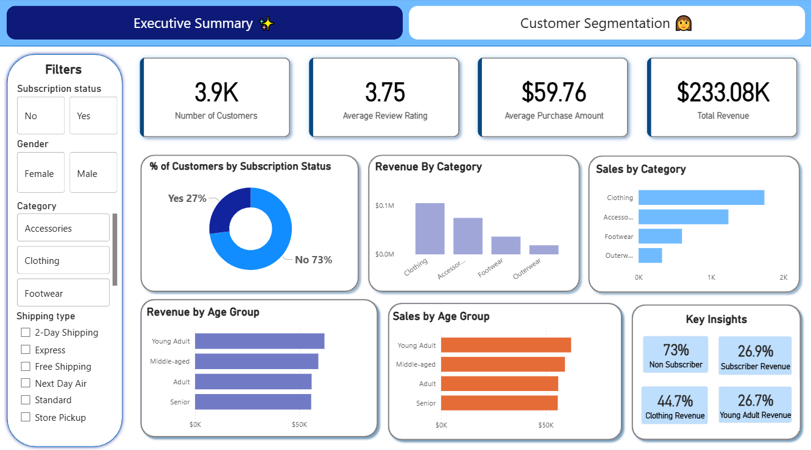
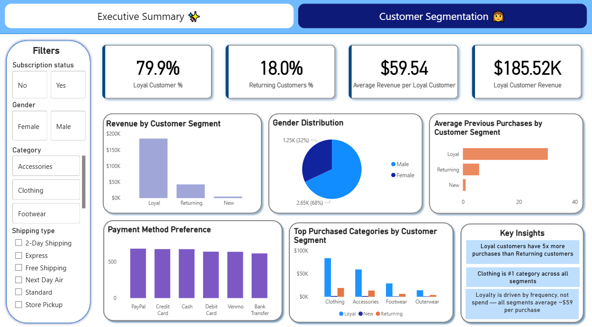

# 📊 Retail Customer Behavior Analytics Dashboard

An end-to-end retail analytics project built using **Python, SQL, and Power BI** to analyze customer purchasing behavior, revenue trends, customer segmentation, and loyalty patterns.

The project transforms raw transactional data into actionable business insights that support data-driven retail decision-making.

---

# 📸 Dashboard Preview

## 🔹 Executive Summary Dashboard

---

## 🔹 Customer Segmentation Dashboard

---

# 📌 Project Overview

This project analyzes customer shopping behavior using transactional retail data containing **3,900 purchase records** across multiple product categories.

The project combines:
- **Python** for data cleaning and exploratory analysis
- **SQL** for business-focused analytical queries
- **Power BI** for interactive dashboard development and KPI reporting

The dashboard uncovers:
- customer spending behavior
- loyalty and retention patterns
- revenue-driving customer segments
- category-level sales performance
- subscription and purchasing trends

---

# 🎯 Business Problem Statement

A retail company wants to better understand customer shopping behavior to improve sales performance, customer engagement, and long-term retention.

The company has observed variations in purchasing patterns across:
- customer demographics
- product categories
- subscription behavior
- payment methods
- discounts and promotional campaigns

Management wants to identify the key factors influencing customer purchasing decisions and loyalty.

This project analyzes consumer shopping data to answer the core business question:

> **How can retail shopping data be leveraged to identify customer trends, improve engagement, and optimize marketing and product strategies?**

---

# 🛠 Tech Stack

## 🔹 Data Cleaning & Analysis
- Python
  - Pandas

## 🔹 Database Querying
- SQL
  - Aggregations
  - CASE Statements
  - Subqueries

## 🔹 Data Visualization
- Power BI
  - Power Query
  - DAX Measures
  - KPI Cards
  - Interactive Filters & Slicers

---

# 📂 Dataset Summary

Source: Public dataset obtained from [GitHub Repository](https://github.com/amlanmohanty1/customer-trends-data-analysis-SQL-Python-PowerBI/blob/main/customer_shopping_behavior.csv)

| Attribute | Details |
|---|---|
| Total Records | 3,900 |
| Total Columns | 18 |
| Missing Values | 37 values in Review Rating |
| Data Type | Retail Transactional Data |

### Key Features
- Customer demographics (Age, Gender, Location, Subscription Status) 
- Purchase details (Item Purchased, Category, Purchase Amount, Season, Size, Color)
- Shopping behavior (Discount Applied, Promo Code Used, Previous Purchases, Frequency of Purchases, Review Rating, Shipping Type) 

---

# 🧹 Data Cleaning & Preparation

Performed preprocessing and transformation tasks including:

- handled missing values
- standardized categorical values
- grouped customers into age categories
- created customer segmentation logic
- created purchase_frequency_days column from purchase data
- verified if discount_applied and promo_code_used were redundant

---

# 📈 Dashboard Walkthrough

# 🔹 Executive Summary Dashboard

Provides a high-level overview of customer purchasing behavior and business performance.

# Walkthrough of Key Visuals

## Filter Panel
- Allows users to filter all dashboard visuals by subscription status, gender, category, and shipping type.
  
## Key KPIs
- **Total Revenue:** $233.08K
- **Average Purchase Amount:** $59.76
- **Average Review Rating:** 3.75
- **Total Customers:** 3.9K

## Revenue by Category (Stacked Column Chart)
   - Displays the total revenue generated by each product category.
## Sales Distribution by Category (Clustered Bar Chart)
   - Shows the total number of sales cross different product categoriesy.
## Revenue by Age Group (Stacked Bar Chart)
  - Displays the total revenue generated by different age groups.
## Sales distribution by age group (Stacked Bar Chart)
   - Shows the total sales contributed by different age groups.
## Subscription analysis (Donut Chart)
  - Compares the percentage distribution of subscriber and non-subscriber customers.
## Key insights
 - Summarizes the major findings and business insights derived from the dashboard analysis.

---

# 🔹 Customer Segmentation Dashboard

Analyzes customer loyalty behavior and purchasing patterns across different customer groups.

## Customer Segments
- Loyal Customers
- Returning Customers
- New Customers

# Walkthrough of Key Visuals

## Filter Panel
- Allows users to filter all dashboard visuals by subscription status, gender, category, and shipping type.

## Key KPIs
- **Loyal Customer Percentage:** 79.9%
- **Returning Customer Percentage:** 18%
- **Loyal Customer Revenue:** $185.52K
- **Average Revenue per Loyal Customer:** $59.54

## Revenue by Customer Segment (Clustered Column Chart)
 - Displays the total revenue generated by each customer segment.
## Gender Distribution (Pie Chart)
  - Compares the percentage distribution of male and female customers.
## Payment Method Preference (Clustered Column Chart)
  - Shows the distribution of customer payment method preferences across different customer segments.
## Average Previous Purchases by Customer Segment (Stacked Bar Chart)
  - Displays the average number of previous purchases made by customers in each segment.
## Top Purchased Categories by Segment (Clustered Column Chart)
 - Shows the most purchased product categories across the customer segments.
## Key insights
 - Summarizes the major findings and business insights derived from the dashboard analysis.
   
---

# 📊 Key Business Insights

### 🔹 Loyal Customers Drive Business Revenue
Loyal customers represent **79.9% of customers** and generate approximately **$185.52K in revenue**, making them the company’s most valuable customer segment.

---

### 🔹 Clothing is the Top Revenue-Generating Category
The Clothing category contributes nearly **45% of total revenue**, outperforming all other product categories.

---

### 🔹 Young Adults Generate the Highest Revenue
Young adults contribute the highest share of customer spending, indicating stronger purchasing engagement among younger demographics.

---

### 🔹 Non-Subscribers Dominate the Customer Base
Approximately **73% of customers are non-subscribers**, highlighting a strong opportunity to improve subscription conversion strategies.

---

### 🔹 Male Customers Represent a Larger Share of the Customer Base
Male customers account for a noticeably higher percentage of total customers compared to female customers, indicating an imbalance in customer distribution and purchasing activity.

---

# 💡 Business Recommendations

### 🔹 Strengthen Customer Retention Programs
Invest in loyalty rewards, personalized offers, and retention-focused campaigns to maximize customer lifetime value.

### 🔹 Expand High-Performing Product Categories
Prioritize inventory planning and targeted promotions for high-performing categories such as Clothing.

### 🔹 Improve Subscription Conversion Rates
Encourage more customers to subscribe through exclusive discounts, rewards, and personalized recommendations.

### 🔹 Develop Targeted Marketing Strategies by Age Group
Since young adults contribute the highest share of revenue, the company should prioritize campaigns tailored to this segment while testing targeted strategies to improve engagement in lower-performing demographics with growth potential.

---

# 💡 Business Impact

This dashboard can help retail businesses:

- identify high-value customer groups
- improve customer retention strategies
- better understand customer purchasing behavior
- improve product targeting and inventory decisions
- support data-driven decision-making

---

# 🚀 How to Use

1. Download the `.pbix` file from the repository
2. Open using Power BI Desktop
3. Refresh the dataset if required
4. Explore the interactive dashboard using slicers and filters

---

# 👩‍💻 Author

**Rafia Ferdous**
- LinkedIn: www.linkedin.com/in/rafia-ferdous-duti
